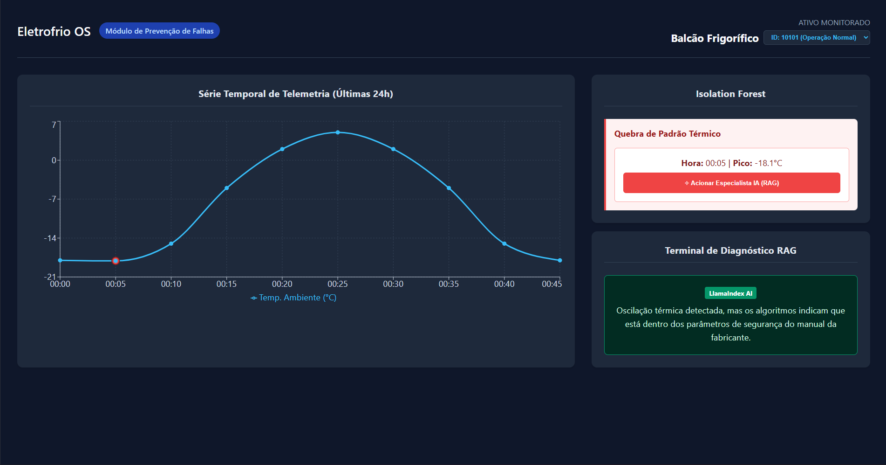
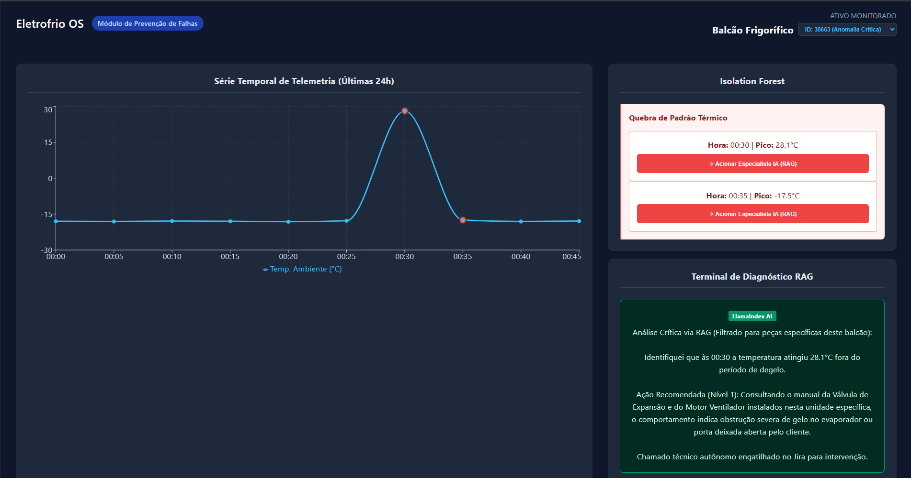

# POC Eletrofrio


---

### Principais Funcionalidades

- **Ingestão Assíncrona:** Consumo de endpoints REST simulando séries temporais de sensores de temperatura e status de equipamentos.
- **Detecção de Anomalias (Isolation Forest):** O motor matemático analisa os dados e identifica quebras de padrão térmico, ignorando falsos positivos gerados por ciclos de degelo.
- **Agente Especialista (RAG):** Simulação de um motor RAG (_Retrieval-Augmented Generation_) que cruza o alerta gerado com a BOM (_Bill of Materials_) do balcão e manuais técnicos, gerando diagnósticos humanizados.
- **Dashboard Reativo:** Interface gráfica para visualização da saúde do equipamento em tempo real.

---

## 🛠️ Stack Tecnológica

### Backend (Motor de IA e API)

- **Python 3.10+**
- **FastAPI** — Construção da API REST
- **Pandas** — Tratamento e pivotamento dos dados brutos (ETL)
- **Scikit-learn** — Modelo preditivo não supervisionado (_Isolation Forest_)

### Frontend (Dashboard)

- **React + Vite**
- **Recharts** — Renderização gráfica das séries temporais

---

## ⚙️ Como Executar Localmente

Siga as instruções abaixo para rodar o projeto na sua máquina.  
Precisará de **dois terminais abertos** (um para o backend e outro para o frontend).

---

## 📋 Pré-requisitos

- [Node.js](https://nodejs.org/) instalado (para rodar o React)
- [Python 3.x](https://www.python.org/downloads/) instalado

---

## 1️⃣ Inicializando o Backend (Python)

Abra o terminal, navegue até a pasta `backend-poc` e siga os passos abaixo:

### 1. Criar ambiente virtual.

```bash
python -m venv venv
```

### 2. Ativar o ambiente virtual.

#### Linux/macOS

```bash
source venv/bin/activate
```

#### Windows

```bash
venv\Scripts\activate
```

### 3. Instalar dependências

```bash
pip install fastapi uvicorn pandas scikit-learn
```

### OU

```bash
pip install -r requirements.txt
```

### 4. Iniciar o servidor

```bash
uvicorn main:app --reload
```

O servidor da API estará disponível em:

```txt
http://localhost:8000
```

---

## 2️⃣ Inicializando o Frontend (React)

Abra um novo terminal, navegue até a pasta `frontend-poc` e siga os passos:

### 1. Instalar dependências

```bash
npm install
```

### 2. Iniciar servidor de desenvolvimento

```bash
npm run dev
```

O painel estará disponível em:

```txt
http://localhost:5173
```

---

## Como Testar a Aplicação

O sistema possui **3 cenários pré-configurados**.

Utilize o menu de seleção (_dropdown_) no topo do painel para alternar entre eles:

---

### ID: 10101 — Operação Normal

Demonstra a estabilidade do equipamento operando dentro do setpoint ideal (**-18°C**).

---

### ID: 20202 — Ciclo de Degelo

A temperatura do equipamento sobe, mas o **Status de Degelo** está ativo.

O algoritmo entende o contexto e **não gera alarmes falsos**.

---

### ID: 30663 — Anomalia Crítica

A temperatura sobe drasticamente fora do degelo.

- O gráfico destaca o desvio padrão em vermelho
- Ao clicar no botão de ação, o motor RAG simula:
  - leitura do manual do compressor
  - cruzamento com a BOM
  - geração de laudo técnico automatizado

---

## 📂 Estrutura Sugerida do Projeto

```bash
poc-root/
│
├── backend-poc/
│   ├── main.py
│   ├── services/
│   ├── models/
│   └── venv/
│
├── frontend-poc/
│   ├── src/
│   ├── public/
│   └── node_modules/
│
└── README.md
```

---

## Preview


Dashboard Temperatura em operação normal

---


Dashboard Temperatura critica

